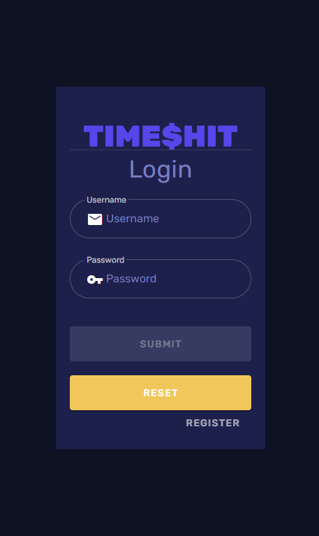
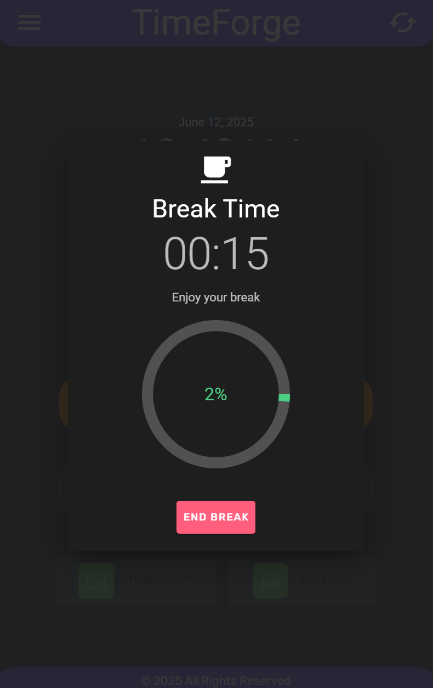
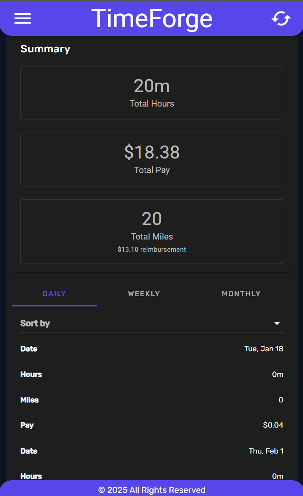

# TimeForge

A professional time tracking application built with Nuxt.js that helps you manage work hours, mileage, and calculate expected payouts.

[View Live Example](https://jaimegonzalezjr.com/Projects/TimeForge)

## Features

- 📊 Time Tracking Dashboard
- 🚗 Mileage Tracker
- 💰 Payout Calculations (Daily, Weekly, Monthly)
- 👤 Customizable User Profiles
- ⚙️ Comprehensive Settings

## Screenshots





## Tech Stack

- Frontend: Nuxt.js with Vuetify
- Backend: Strapi Headless CMS
- Authentication: Google and existing local accounts through native Strapi authentication
- Styling: Vuetify Material Design Framework

## Prerequisites

- Node.js (v14 or later recommended)
- npm or yarn package manager
- Docker (optional, for containerized Strapi)

## Setup Instructions

### 1. Frontend Setup (TimeForge)

```bash
# Clone the repository
git clone https://github.com/yourusername/timeforge.git
cd timeforge

# Install dependencies (using npm)
npm install --legacy-peer-deps

# OR if using yarn
yarn install --legacy-peer-deps

# Create .env file
cp .env.example .env
```

### 2. Environment Configuration

Create a `.env` file in the root directory with the following content:

```
# Development
API_AUTH_URL=https://api.jaimegonzalezjr.com
NODE_ENV=development

# Production (update when deploying)
# API_AUTH_URL=https://api.jaimegonzalezjr.com
```

### 3. Strapi Backend Setup

```bash
# Create a new Strapi project
npx create-strapi-app@latest timeforge-backend --quickstart

# Once Strapi is running, create an admin account at:
# http://localhost:1337/admin
```

#### Required Strapi Configuration:

1. Create Content Types:

   - TimeEntry

     - date (datetime)
     - startTime (time)
     - endTime (time)
     - description (text)
     - user (relation to User)

   - MileageEntry
     - date (date)
     - miles (decimal)
     - description (text)
     - user (relation to User)

2. Configure Permissions:
   - Go to Settings → Users & Permissions Plugin → Roles
   - Edit the Authenticated role
   - Enable necessary CRUD operations for TimeEntry and MileageEntry

### 4. Running the Application

#### Development Mode

```bash
# Start Strapi backend (in timeforge-backend directory)
npm run develop
# or yarn develop

# Start Nuxt frontend (in main project directory)
npm run dev
# or yarn dev
```

The application will be available at: http://localhost:3000

#### Production Build

```bash
# Generate static files
npm run generate
# or yarn generate

# Serve the static files
npm run start
# or yarn start
```

## Deployment Options

### Frontend Deployment

You can deploy the static frontend to:

- GitHub Pages
- Netlify
- Vercel
- Any static hosting service

### Backend Deployment

For Strapi, you can:

- Use a Platform-as-a-Service (PaaS) like Heroku
- Deploy to a VPS
- Use managed services like DigitalOcean App Platform

## Contributing

Contributions are welcome! Please feel free to submit a Pull Request.

## License

This project is licensed under the MIT License - see the [LICENSE](LICENSE) file for details.

## Acknowledgments

- Built with Nuxt.js
- Styled with Vuetify
- Powered by Strapi CMS

## Shared sign-in deployment

This frontend uses native Strapi endpoints at `https://api.jaimegonzalezjr.com`: `POST /auth/local`, `GET /users/me`, and `GET /auth/google/callback`. The returned JWT uses the shared same-origin local-storage key `strapi_jwt` and is sent in the Authorization bearer header. Logout clears that key and best-effort clears legacy cookies through `/auth/logout`.

Google starts through native Strapi-host Google connect until its Google Console redirect migration. Register applications in Strapi Admin → OAuth Applications with a key, name, HTTPS callbackUrl, HTTPS returnUrl, and enabled flag. Point each app’s login button to the common callback page with `?app=its-key`. The public `GET /oauthapplications?key=its-key` endpoint returns only that enabled app; adding an app does not require editing frontend allowlists. All participating applications return through `/Projects/TimeForge/auth/google`. A per-tab nonce verifies the return, sensitive query parameters are removed from browser history immediately, and onward destinations come from the enabled OAuth Applications registry. Provider tokens are exchanged for the native Strapi JWT.

Pay rate is separate from identity. Native `GET /timeforgeprofiles` returns the authenticated user's profile list; `POST /timeforgeprofiles` creates their profile and `PUT /timeforgeprofiles/:id` updates it. Server controllers must enforce ownership on profiles and timesheets, regardless of browser guards. New users have an unset pay rate.

The default frontend base path is `/Projects/TimeForge/`. Override `NUXT_APP_BASE_URL` for a different deployment and register its return URL server-side. `API_AUTH_URL` is public configuration; do not include provider secrets in the frontend. Google client configuration belongs on the API. Existing local registration remains available and may require email confirmation according to backend policy; this frontend does not bypass confirmation or merge existing accounts.

Run `npm test` for native authentication regressions and `npm run build` to verify the production bundle.

### Synology Web Station

Work from `/volume1/git-server/environment/NodeJS/TimeForge`. Set `NUXT_PUBLIC_API_BASE_URL` (or legacy `API_AUTH_URL`) and `NUXT_APP_BASE_URL` in `.env` before building. Static assets embed these public settings.

Run `npm run generate`, then `npm run deploy:preview` to review source, destination and backup path without writing the web root. `npm run deploy` regenerates and copies to `DEPLOY_TARGET` (default `/volume1/web/Projects/TimeForge`) after backing up the existing directory outside the web root. It never deletes unrelated destination files. Coordinate deployment with the native Strapi controllers and Google callback allowlist. Configure the web server to serve `200.html` for SPA deep links such as `/Projects/TimeForge/login`.

Profile photo uploads are temporarily disabled pending a server-authorized upload route. Existing photos remain visible when supplied in the session response.

In-progress clock drafts are now stored under the authenticated account ID. Legacy unscoped drafts are retained in browser storage but are not automatically assigned to whichever account signs in. Finish any active legacy shift before switching the deployed frontend.

The Nuxt commands preload a Synology-only workaround for the installed Node runtime crashing when iterating `Intl.Segmenter` results. It disables that optional formatting API for build tools, which fall back to character splitting; it does not alter browser runtime code.

## Account UI and app-local callbacks

TimeForge mounts the universal account form from `https://api.jaimegonzalezjr.com/auth/client.v1.js` inside its own layout. That client lives in the Strapi repository. Google returns to TimeForge's own `/auth/google` route; games use their own callback pages. Configure methods, password registration, callback/return URL, and shared/separate session in Strapi Content Manager → OAuth Applications. TimeForge currently supports Google and password/register with shared login. The local Strapi adapter keeps profile/timesheet requests in this app and delegates account operations to the shared client.

TimeForge is a static client-rendered SPA (`ssr:false`) deployed from `.output/public`. No service worker is registered. Startup retires only TimeForge-scoped workers and its explicitly known legacy `/sw-custom.js` registration; other apps' workers and caches are untouched. Break reminders run only while the page is open. The Profile page (`/profile`, with `/settings` compatibility redirect) shows shared identity, edits the shared display name and stores the hourly rate separately in the TimeForge profile.


### Synology SPA hosting

The generated site has one HTML entry: `.output/public/index.html`. Vue Router handles application routes; `ssr: false` and disabled link crawling prevent per-page HTML exports. Static images belong in `public/`; the favicon URL uses the configured app base.

`ops/nginx/timeforge.conf` scopes Web Station's SPA fallback and cache revalidation to `/Projects/TimeForge/`. Install with `ops/install-webstation-cache.py` as a Synology administrator; it validates nginx before reloading and restores the previous include on failure. Reapply after a Web Station update if the custom include is removed. The deploy script checks this configuration before retiring old route HTML files, and backs up the existing application first.

The Google callback navigates to a fresh root document using a temporary `_auth_return` query parameter. The authenticated route guard removes it using client navigation. This prevents browsers with legacy cached HTML from loading the retired auth implementation after a successful Google exchange. No credential is included in that parameter.
